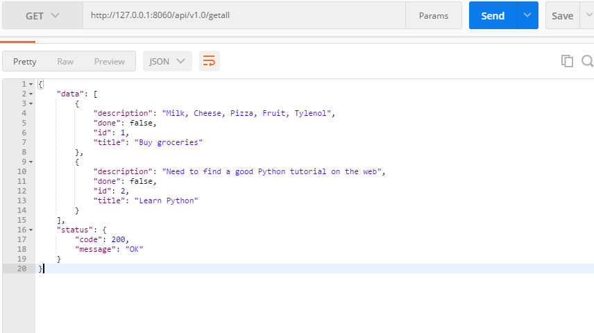
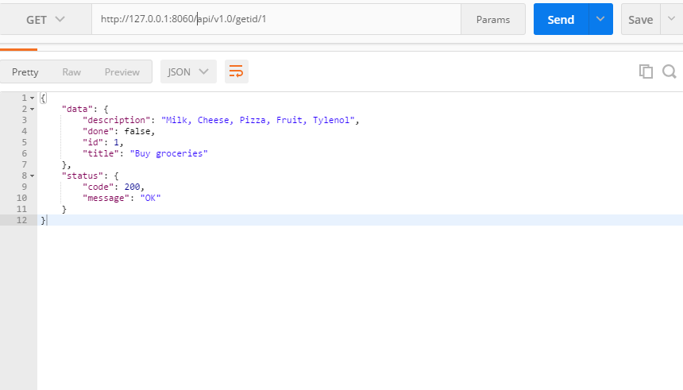
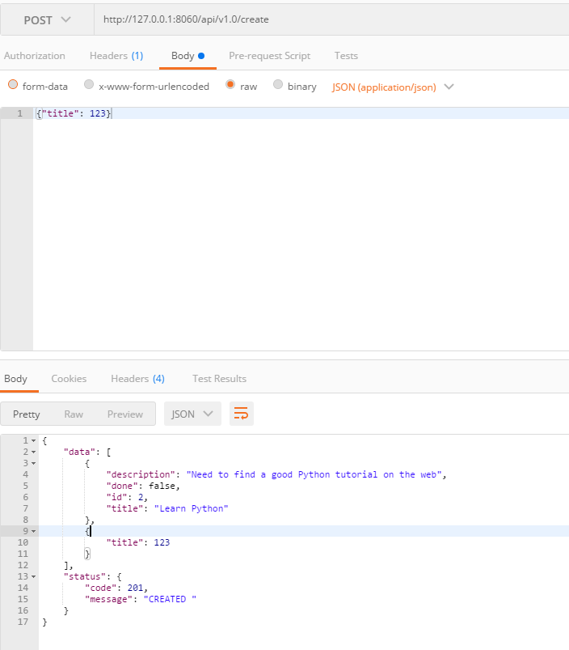
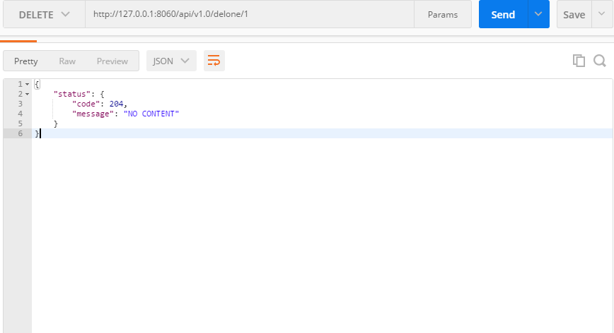
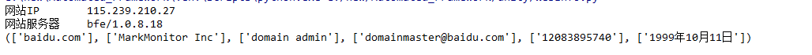
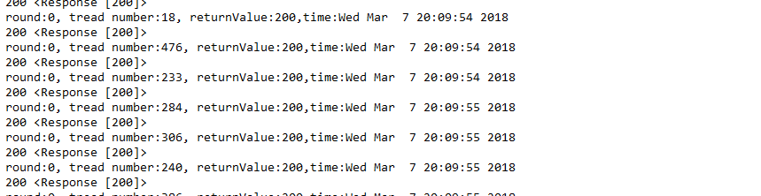

Automated_Framework
===

## 目录说明
- config    配置
- data      数据
- driver    驱动文件
- log       日志
- report    报告
- src       源码程序
- unity     工具
## 
2018-03-05 selenium + python + easygui 实现登陆一个字符型验证码网站
##
2018-03-06
使用 flask 定义restfulAPI ,相关文件在[app.py](web/flask_web/app.py).
- 定义接口包括
    - 查询所有数据 get_all()
    - 查询指定id数据 get_id()
    - 增加一条数据 add_one()
    - 删除一条数据 del_one()

- 效果图
    - 查询所有
    
    - 查询指定id
    
    - 增加一条数据
    
    - 删除一条数据
    
    
##
2018-03-07
- 定义接口
    - 带验证接口authenticate()
- 接口访问

- 增加一个[WebInfo](unity/WebInfo.py)模块
    - getip()
    - get_server()
    - get_whois()
    
- 增加一个[config](unity/Config.py)模块,支持Yaml
- 增加一个压力测试[Pressure.py](src/Pressure.py)
    - 测试图
    